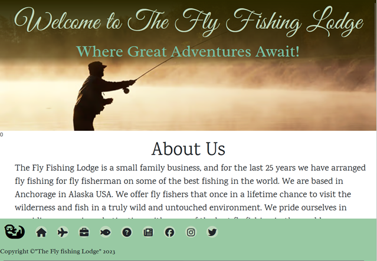

<h1 align="center">Stewart Gibbons Project 1 - The Fly Fishing Lodge </h1>

<h2 align="center" ></h2>

This is the main marketing and sales site for the fictiuos fly fishing out fitters in Alaska called "The Fly Fihing Lodge". The site was  designed to be responsive and usable on a range of devices, making it easy and accessible for all propective visitors to the The Fly Fishing Lodge. The site consists 3 pages a home/landing page (index), which is built to encourage visitors to further explore. A Faq page which further builds on the visitor experience, and delves into the detail of what the business offers, and then a contact/form page which allows users to keep in contact with the site, through signing up to the newsletter and pricing with either the example pricing on the page or buy asking for a personalised quote.

the site utilises Bootstrap libraries througout to mak ethe site responsive using 
- Grid function - colum/row
- Responsive headings fonts and styles 
- Responsive images
- Responsive form settings   

The site will present and use responsive elemensts to provide in a structured, readable, easy to navigate web site, thats works across mutiple screen sizes, devices. To provide a good UX experince.

[View the live project here.](https://coelecanth.github.io/Project1-final/)

## **Table of Contents**  
- [Introduction](#introduction)
- [User Experiences (UX) - User Stories](#user-experiences-ux---user-stories)
  - [As a potential customer:](#as-a-potential-customer)
  - [As the Business Owner:](#as-the-business-owner)
  - [Strategy](#strategy)
    - [Site Goals](#site-goals)
  - [Skeleton](#skeleton)
    - [Wireframes](#wireframes)
- [Design](#design)
  - [Design developement](#design-developement)
  - [Colour scheme](#colour-scheme)
    - [Colour Palette](#colour-palette)
  - [Typography](#typography)
  - [Icons](#icons)
  - [Images](#images)
  - [Home Page (index.html)](#home-page-indexhtml)
    - [About Us](#about-us)
  - [FAQ Page (Faq.html)](#faq-page-faqhtml)
  - [Contact - Enquiry/newsletter Page (Forms.html)](#contact---enquirynewsletter-page-formshtml)
  - [Footer/Navbar](#footernavbar)
- [Technologies Used](#technologies-used)
  - [Languages](#languages)
  - [Frameworks, Libraries & Programs Used](#frameworks-libraries--programs-used)
    - [1. Bootstrap 5.3](#1-bootstrap-53)
    - [2. JSdeliver](#2-jsdeliver)
    - [3. Font Awesome](#3-font-awesome)
    - [4. Git](#4-git)
    - [5. GitHub:](#5-github)
    - [6. GitPod](#6-gitpod)
    - [7. Squoosh](#7-squoosh)
    - [8. Visio](#8-visio)
    - [9. Google Fonts](#9-google-fonts)
    - [10 CSSGradient](#10-cssgradient)
    - [11. StackOverflow](#11-stackoverflow)
    - [12. Doc Toc](#12-doc-toc)
- [Testing](#testing)
  - [High Level Test Strategy](#high-level-test-strategy)
  - [Device base](#device-base)
    - [User Engagament](#user-engagament)
      - [First time User Testing](#first-time-user-testing)
    - [Browser Compatibility](#browser-compatibility)
    - [MarkUp Validation - See mentor review - for address to below](#markup-validation---see-mentor-review---for-address-to-below)
- [Test Results](#test-results)
  - [Results-Browser Compatibility](#results-browser-compatibility)
  - [Results-Resposiveness/Compatability](#results-resposivenesscompatability)
    - [The Sizes set in Bootstrap are:](#the-sizes-set-in-bootstrap-are)
    - [Outcome](#outcome)
      - [Devices Selected for Testing](#devices-selected-for-testing)
  - [Results-User testing](#results-user-testing)
    - [Outcome](#outcome-1)
    - [Additional user testing](#additional-user-testing)
  - [Results-Hero banner](#results-hero-banner)
    - [Expected outcome](#expected-outcome)
    - [Outcome](#outcome-2)
  - [Results-Image band](#results-image-band)
    - [Outcome](#outcome-3)
      - [Test result Images](#test-result-images)
  - [Results-Speed and Resposiveness](#results-speed-and-resposiveness)
      - [Lighthouse testing](#lighthouse-testing)
      - [GtMetrix Testing](#gtmetrix-testing)
  - [Results-W3c MarkUp Validation](#results-w3c-markup-validation)
- [Testing Issues and Resolution](#testing-issues-and-resolution)
  - [Slow rendering performance - index.html](#slow-rendering-performance---indexhtml)
    - [Alternative approach](#alternative-approach)
    - [**GitHub Pages**](#github-pages)
    - [**Forking the GitHub Repository**](#forking-the-github-repository)
    - [**Cloning the GitHub Repository**](#cloning-the-github-repository)

<!-- END doctoc generated TOC please keep comment here to allow auto update -->

 

# Introduction 
   Alaska Fly fishing is a business which is a premium wilderness destination for people who enjoy fly-fishing for the native salmon and trout species of the northwest pacific coast in Alaska USA. It is operated and run from Anchorage in Alaska.    

   The site is there to attract the growing number of men and woman, who see idea of going to a remote wilderness location as a once in lifetime expereince. 
   So the intened audience for the site is some one looking who to fulfil that once in a lifetime adventure holiday to wildernes and fly fishing. 
   To a destination in the wilderness, even just having an adventure to get there.  
    
   As the destination is very much driven by seasonal migration of the Salmon and other species as the times they enter the river, the pricing for this and the duration of the stay is custom built for the user, and would include the legs of the transport to the destination, after arriving at Anchorage.    

# User Experiences (UX) - User Stories

## As a potential customer:

    - At first glance I want to be engaged by the site to want to know about the destination and actitivty and navigate through the rest of the site
    - I want to have an insight into the company and where they operate
    - I want to be able to see what services they offer
    - I want understand how I reach such a remote destination
    - I want to feel that Alaska Fly fishing is a professional outfit,  feel assured I will reach there
    - I want to feel that my stay will be comfortbale and I will be well looked after  
    - i want to know what the best time of the year is to go to Alska Fly Fishing
    - I want to be able to stay in touch with them to understand more (see there current visiots of the season and the visitors to the destination) 
    - I want to see how i get pricing for the Alaska fly fishing 
    - I want to know how to get in touch with the company
    - I want to see pictures of wilderness and the fishing, and what fish i can catch 
    - I want to see what hours the company operates at
    - I want to be able to see and click on the links to their social media pages
    - I want to easily navigate through the site without becoming overwhelmed with too much information
    - I want the Alaska Fly fishing help me understand what i need to bring with me and options around this
   
## As the Business Owner:

    - I want to generate new business by getting users to contact the company, and book visits to us 
    - I want users to easily navigate through the site  
    - At the conclusion of this acitivity be confident that vistors will contact the company
    - I want the site to show the this is quality experience, and provides good levels of comfort 
    - I want the site to show how Alaska fly fishing, takes away the complexity and uncertainiy of getting to the destination   
    - I want to encourage users to go to our social media pages which will help boost the profile of the company
    - As this site will be very much image driven and will cater to older user market it will be predomintantly aimed as a large screen first websit, BUT....
    - I want the site to be responsive so users on any platform or screen size can successfully navigate the site,
        so users on any platform or screen size can have enjoyable UX experience  

## Strategy

### Site Goals

    This particular project is to design and create a static website that is done mainly through HTML and CSS., and use supporting code libraries such as Bootstrap. 

    The main goal for the website is to get potential customers to engage and then book a visit to the wilderness Lodge of Alaska Fly fishing, by impressing upon on them them the following: 
    - The unique wilderness
    - The excellent fly fishing avialable to them
    - Remove as much duress - show how Alaska fly fishing, takes away the complexity and uncertainiy of getting to the destination   
    - Be able to stay there in a high levelof  comfort  
    - Encouraging the visior to get in contact or stay in contact through subscribing to the news letter . 

    The site from the first landing point will need to be appealing in design so that it appeals to users giving a pleasing out come and thus standing out. This then encourages the user to want to further explore the site. By making the site fully responsive to different screen sizes (basically there are 3 disiticnt screen sizes) with a single page scroll and navigation bar fixed and visible at all times, the site aims to be easily accessible no matter which platform the user is viewing the site on.

    The sites goal of "luxury service and accomdation in the wilderness" means that the user gets the right sense that this is a high quality lodge with well established history, but also a friendly family owned and run business, which works with the local native communities and leaves little or no impact on the envioronment.   
    To establish the site provides high quality images applealing to the fly fisher. This will reinforce the goals and overall impression of a duress free visit with some excelleennt fly fishing staying in luxury accomadation. 

## Skeleton

    To create the overall design of this website I portryed the pages and there layout as wireframes using Microsoft Visio and showed the layout of the sites pages. 
    There were three pages depicted and each set of depinctions show the page in its designed view eg Desktop, Tablet, Mobile.
    This was done to show the responsiveness of the layout on different devices, and how it was intended to work. Not all pages have a depiction for all sizes as the responsive requiremnt for each was differnt e.g. the forms page. As all pages would be linked to each other through the use of the fixed Navbar the depiction of the links seemed uneccesary.  
    
### Wireframes

 
# Design
## Design developement 
    From The wireframes creation, the development of the site was then delivered in the following steps 
    Selection of: 
    - Fonts - typograhy
    - Colour scheme - selection of colour palette for the site 
    - Icons - Icons required for the site  
    - Images - Image selection for the site
    - Build of the site - creating pages and then adding linking and features, and 
    - Testing - Once the features, structure, had been established then clearer objectives for testing were created ad documented in the read.me (this document)
    - Documenatation - this was doen throughout the process, adding the relevant comments in the site files and sections in the read.me (this document)  
  

## Colour scheme

    The overall design for the home page and FAQ page was to have a white backdrop where all the text and images were placed, this would be accentuated using the colours from the chosen palette with fonts, coloured bands (housing Images) navbar, transaprent coloured framing boxes. the only real exception to this was in the following 
    - The hero banner section of each page 
    - The conmtact/form page which uses an image as the complete background.   

### Colour Palette
    The colours within the chosen palette were chosen to provide a sympathetic colour represnrting the the typical colours found in a destination based in the Pacific north west forest region. Tints and Shades of these colours used are predominatly greens and browns with some leaning to blue. They were chosen using the site coolors.co located here 
    https://coolors.co/002d00-2a2600-77bfa3-98c9a3-bfd8bd. 
     

    The colour reference and there names are as follows:
    - pakistan-green: #002d00ff;
    - drab-dark-brown: #2a2600ff;
    - cambridge-blue: #77bfa3ff;
    - celadon: #98c9a3ff;
    - tea-green: #bfd8bdff;

    For reference and clarity these have been detailed in the style.css as a comment.

## Typography
    Fonts I used  were chosen from Fontjoy.com which provides a mechanism to mix and match together fonts to provide aestically pleasing results. 

    The following 3 fonts were chosen to provide good contrast in styles to each other and be symapthetic with the site and its function 

    - Great Vibes - a script like font used in all the main titles, as suggested in fontjoy 
    - Radley - used to provide contrast in all other heading as suggested in fontjoy 
    - Karma - used throughtour in the body as suggested in fontjoy 

    The Karma font is the main font used throughout the whole website used in the body test of pages. 
    With Sans Serif as the fallback font (in case for any reason the font isn't being imported into the site correctly). 
    Karma is a clean font and differntitates strongly in compairison with great Vibes and is more complimnetary to Radley  

    The Radley font is used throughout for heading in the page to provide moderate contrast to Karma
    and Highlight against XXX 
    the weight of the font was chosedn to be heavier to give a more bold appreance for headings .also used for Copyright

    An additiona font of Great Vibes is used in the hero banner to create a less formal feel to the website, with a backup font of cursive. 
    The font is a script like font and works well in larger sizes   

    All fonts were sourced and referenced from google fonts and imported in the style.css 

## Icons

    The icons used are all found at Font Awesome. Having icons as the social media links immediately allows the user to easily identify which social media platform is which. The icons on the footer used to identify the opening hours, address and telephone numbers are all easily appealing on the eye for the user.
    Features
    Navigation Bar
    Screenshots

## Images

    The images have been chosen to reflect the destination with pictures of fly fishing and fish, and the experience of the wilderness. This was by far, one of the most challenging tasks of completing this project. As the images needed to be very specific to fit the content of site. Because of this very specific nature of the images required, I used some of my personal pictures from previous trips i have made, to supplement the stock imagery. This was because of the scarcity of the right type of images. 

    The images were sourced from: 
    - Istock https://www.istockphoto.com/
    - From my personal picture collection

## Home Page (index.html)
    The structure of the index page consists of a single scrollable page rather than short page with mutiple linked resources. 
    To improve UX expereince the index page provides short introduction with impact, to the sites services/business. the page provides pointers to other areas containing the detail on the site. 
    
    This should give a more accessible experience for all and by doing so will adopt a more mobile-first design. Although market reserach for this business, givens its demographic and age of people (50+ years and skilled professional), would suggest a preference to use larger screen devices, so lending to the idea of providing high quality images to enforce the expereince of what is on offer from the siyte. 
### Hero Banner
    Hero banner uses a background that was chosen to be enigmatic and sympathetic to the site, and would complement the overall colour to the sites colour palette.

    To increase contrast (with the light coloured font colour) and also visual appeal, a transparent  darkened bar was envisaged to overlay across the top half of the hero image to include the site heading and tagline, increase contrast against light coloured font colours. After initial implementation of the bar, the effect it provided gave the intended impact and contrast, but it was felt to be somewhat distracting as being a box it had a very distinct defined finish. This detracted from overall enigmatic scene. For this this reason the transparent box was replaced, with a box with a transparent coloured gradient box running from top to bottom (dark to light, using one of the darker palette colours). This provided the necessary contrast but provided a much more subtle effect and more in keeping with overall image impact.
    The page also  utilises a coloured bar with images contained in it which is responsive so as viewport is changed, so does the image configuration (as shown in the wire frames). The bar was designed to reinforce the visual impact of the site with high quality images of fly fishing experience and locations 
   
### About Us Section 
    The about us section in the home page, provides is a simple layout which features the a header, a few paragraphs of text and the button blow the text that links to the FAQ section.
    The user will be given a brief introduction as to who the company are, what they can expect from the company and allow them to go straight to the FAQ or are directed via the navbar to the contacts page for pricing and quotes. A the first time user of the site is most unlikely to go straight to pricing before understanding the serive the deciasion was made to provide the link to the contact page from NavBar. 

## FAQ Page (Faq.html) 
    The faq page contains the more detailed explanation as to what the business offers. Where As the home page is more about the highlights and the most immediatte information FAQ page provided the more substantial detail as to what the destination and services that are offered by the Fly fishing Lodge. 
    To this end the FAQ adopts a layout to section the topics into easy to read chunks, with the ability to extend this if there were other services or information neeeded to be provided without breaking the overall desigmn and there fore interest and impact.    
    The faq contains an image collection and text which is split into horizontal rows which consume the screen estate in a one third two to third ratio. 
    The rows alternate in aspect eg 1/3-2/3 second row 2/3-1/3, and so keeps alternating down the page. This creates a visually pleasing arrangement. The text consumes 1/3 and the image 2/3. 
    each of the images shown next to the coresponding text has direct relevance to the subject e.g. the expalantion as to how you travel to the lodge shows a float plane and guests next to it. 

## Contact - Enquiry/newsletter Page (Forms.html) 

    The design for the form departed from the white background of the other pages. The design was to have a background enigmatic fly fishing scene which covers the forms page. The hero image was dropped as the inclusion of both would create visual chaos and would have been detrimental to the overall appeal. 
    The forms  page uses the full background image of fly fishing scene which is very much in keepings with site. 
    As this image now differs from hero Image background the  transparent coloured gradient box for the text headline and tagline for the banner had to be altered to give a more balanced contrast. 
    So the gradient was altered to provide better contrast against the different colour image background, the changes made were to give a darker colour and more contrast,  The tagline heading colour was also changed to again promote good contrast and readability with the colour palette available.  

## Footer/Navbar 

    The footer will be fixed so as to allow user to move between pages regardless of where they on the page or site. The navigation items will be icons sourced from font awesome using there libraries and CDN.   
    The Navigartion bar will use Bootstrap to provide responsive for screen size using the navbar toggler, that means that at reduced screen sizes a menu will appear and only show icons once clicked,  the item will be shown horizontally across the screen to reduce the screen estate consumed in the mobile view. 
     
# Technologies Used 

## Languages
1. HTML5
1. CSS3 

## Frameworks, Libraries & Programs Used
### 1. [Bootstrap 5.3](https://getbootstrap.com/docs/5.3/getting-started/introduction/)
    - Bootstrap was used to assist with the capabiliites and responsiveness and styling of the website. It is sued extensively througout the site, and in addition the jscript element is also used see below.

### 2. [JSdeliver](https://getbootstrap.com/docs/5.3/getting-started/introduction/)  
     - jSdeliver came with Bootstrap to make the navbar responsive, and is really only used for this aspect. It was deemed necessary, as at smaller screen sizes the icons depicted in the navbar consumend too much screen real estate. 

### 3. [Font Awesome](https://fontawesome.com/) 
     - Font Awesome was used throughout the website in the navbar to add icons for aesthetic and UX purposes. 
### 4. [Git](https://git-scm.com/) 
     - Git was used for version control by utilizing the Gitpod terminal to commit to Git and Push to GitHub.
### 5. [GitHub:](https://github.com/) 
     - GitHub is used to store the projects code after being pushed from Git.

### 6. [GitPod](https://www.gitpod.io/)
     - Gitpod was the IDE that i used to edit and build pages in. 

 ### 7. [Squoosh](https://squoosh.app/)
    -  Squooosh was used to perform the following functions 
        - convert the images from jpg to Avif 
        - Also to resize (reduce pixel count) the images to a more managable size to improve download speed and fit in the pages
### 8. [Visio](https://support.microsoft.com/en-gb/office/install-visio-or-access-visio-for-the-web-f98f21e3-aa02-4827-9167-ddab5b025710) 
     - Visio was used to create the wireframes during the design process. as this was a tool I am  very fmailar with and have license for. and I used this tool for expendency, over tools like Figma which would require me to learn. 
### 9. [Google Fonts](https://fonts.google.com/)
    - Google fonts was used to source the fonts that were sleected from FontAwesome. 
### 10 [CSSGradient](https://cssgradient.io/) 
    - CSSGradient.io was used to generate css gradient backgrounds.
### 11. [StackOverflow](https://stackoverflow.com/) 
    - Stack overflow was an invaluable resource I used for code validation, examples and research.
### 12. [DocToc](https://github.com/thlorenz/doctoc) 
    - DocToc was an invaluable tool for creating and modifying Document table of Contents in my Readme.md
### 13. [FontJoy](https://fontjoy.com/)
     - Font joy was used in the design process to create a palette of fonts, 
    
**Quote** from https://fontjoy.com/  

 *The goal of font pairing is to select fonts that share an overarching theme yet have a pleasing contrast. Which fonts work together is largely a matter of intuition, but we approach this problem with a neural net.*

# Testing

## High Level Test Strategy 
    - Responsiveness -  tested across mutiple screen size devices 
    - Speed  - download and render 
    - User testing - user interaction
    - Browser Compatibility
    - MarkUp Validation

## Device base 
The follwoing devices were tested against, these were selected to provide a broad but common base of devices,
representing devices using IOS Android, Windows with varying screen sizes  
   

    Emulated devices using Google Chrome emulator   
    - Iphone XR 
    - galaxy s20 
    - Ipad mini 
    - Kindle fire 
    - Ipad Pro
    Physical device 
    - Pc desktop -  Firefox, Chrome, and Edge
    - Samsung s22 Ultra - Firefox and Chrome    

### User Engagament 
 #### First time User Testing 

    1. As a First Time User of the site, I want to easily understand the purpose of the site and what services it can offer.
    2. As a First Time User of the site, I want to be able to easily locate the information for considerations that I would want ,when planning/booking a trip such as this.
     - these would include 
         - What is the destination like 
         - What fish can I catch? 
         - When should i consider visting 
         - Accomadation and levels of comfort
         - How does this destination help me to achieve this trip more easliy

     3. As a First Time User of the site, I want to be able to easily navigate throughout the site to understand details, and the services offered
     4. As a First Time User of the site, I want to understand what their visitors to the fly fishing lodge think of them and see if they are trusted. 
     5. I also want to locate their social media links to see their followings on social media to determine how trusted and known they are.
     6. I want to engae with the the fly fishing to see people Expereinces and visits to them 

### Browser Compatibility
    The site was tested on the following browsers:
    - Google Chrome
    - Mozilla Firefox
    - Microsoft Edge

 
### MarkUp Validation - See mentor review - for address to below 
    The W3C Markup Validator and W3C CSS Validator Services were used to validate every page of the project to ensure there were no syntax errors in the project.
    - W3C Markup Validator - Results can be seen in TESTING.md including errors and final validation
    -  W3C CSS Validator - - Results can be seen in TESTING.md including errors and final validation

# Test Results 

## Results-Browser Compatibility
On all three of the listed below browsers in the final tests the site performed as predicted with no browsers issues found.
 - Google Chrome
 - Mozilla Firefox
 - Microsoft Edge

## Results-Resposiveness/Compatability 
    This group of testing was specifically targeted to make sure that the site responded as it was designed to, 
    with regard to the use of the Bootstrap grid and responsiveness.
    The tests were carried out across multiple devices (Emulated and Physical) with differing screen sizes, 
    which correspond to the following Bootstrap grid size e.g. Small Medium and Large.  

### The Sizes set in Bootstrap are:
    - Small 	576px 
    - Medium	≥768px
    - Large 	≥992px
### Outcome 
    The site performed as predicted with final tests no browsers issues found.

#### Devices Selected for Testing 
    The devices selected were 
    - Small (virtual)
    - Iphone XR 
    - galaxy s20 
    - Medium (virtual)
    - Ipad mini 
    - Kindle fire 
    - Large 
    - Ipad Pro (virtual)
    - Pc desktop (Physical device ) -  Firefox, Chrome, and IE

## Results-User testing
    This group of testing was conducted to see if the wbsite met the criteris as stated in the User testing 
    was conducted by a small number of users (family Memebrs)  who were not involved in the development of the site 
    and were ask to use the site and then review the site based on the above test criteira 
### Outcome 
    The site performed as expected by users and the criteria and no issues were encountered in test phase.    
### Additional user testing
    During the whole developme of the site the userability of the site was one of the key considerations when it was being constructed and unit tested
    so was subjected to thsi testing throughout the developemnt of the site.      

## Results-Hero banner  
    During the development of the site the functionality of the her Bnnae r was tested and retested to make it comply with eh design 
    So was subjected to testing throughout the developemnt of the site. 
### Expected outcome 
    - the hero Immage and text would be resized and behave appropriattely across all devices and browsers
### Outcome 
    - Resizing responsiveness of the text and iamge in the hero banner behaved as expected  

## Results-Image band 
    During the development of the site the functionality of the her Image band was tested and retested to make it comply with eh design 
    So was subjected to testing throughout the developemnt of the site. 
    The Expected behaviour is:        
    - small - The image would be stacked verically one over the other
    - medium - The images would be stacked 2 over 1 (3rd image) 
    - large - The 3 images would span across the page - horizontally   
### Outcome 
     - Resizing responsiveness was observed across all devices 
#### Test result Images 

    Image band at large size

    
    Image band at Medium size

    
## Results-Speed and Resposiveness
    The speed and rendering for the site were tested with Lighthouse and [GtMetrix](https://gtmetrix.com/) tools

#### Lighthouse testing 
    Initally there was some downloading time issues observed which were corrected by 
    converting all the images to avif and resizing the pixel to approx pixels per image (where possible) 

    Post file conversersion the tool wwas still showing excessive rendering time of the images 
    This was discovered to be a consequence of the use of bootstrap fluid parameter and and the number of images and pixel size
    See Testing Issues for more information on this. 

    Overall performance achieved was 80% or better in lighthousem, but could potentially be improved upon.   

    Also noted here was the score for best practice from lighthouse this seemed to be attributed bootstrap 
    JS event handler not firing reliably and so was beyond the scope of resolution.  

#### [GtMetrix](https://gtmetrix.com/) Testing 
    When the site was tested with GtMetrix; the tool reported back, the site had good performance for all pages.  
    The recommendations for improvement FAQ page did state that the performance could be improved by declaring statics sizes for the images on the page, but this would directly impact the pages responsiveness. 
    The results are as shown below

 

## Results-[W3c MarkUp Validation](https://validator.w3.org/#validate_by_uri)

    The HTML Markup was cheked using w3c Markup validation checker 
    
    When running this tool, there was a warning which advised to remove the <section> tag in faq.html page, 
    as there was no Heading present. As this was intentional and the other option was to place it within 
    
 tag which was already had been done the <section> tag was removed.  

# Testing Issues and Resolution

## Slow rendering performance - index.html
    So when testing with lighthouse in the chrome browser I was getting consistenly slow performance score  
    - I changed all the images in the page to avif from jpg to reduce there size, and re-run the tests and it was still slow to render (not load). This removed any possible connection with file format or size. the downlaod speed of the actual file.
    - Having researched this as to what causes slow rendering (of 5 secs in the browser), the explanation is that image format and size of the image is not really the issue. 
    - It was bootstrap grid setting I have set of “container-fluid” which forces the browser to cover the whole width page of the row with the iamge, in this case the image covers the whole row. 
    - This causes the image to be resized excessively by the browser.
    - Once I removed "fluid" element as a test, the reduction in render was immediatte and worked with massive reduction in rendering to approx. 1000 ms (previous was 5000 ms). 
    - So now realising what the issue is, How to overome the browser taking too long to resize this image, eseentiall the image has to be stretched across a row. 
    - I changed the image size, it seems the browser needs more effort to upscale it han down scale it, So i needed to make the image bigger in its pixel count, from 700 to 1400px. To reduce the effort by the browser to resize. 
    - Having changed the image to this pixel count and saved as an Avif. I have acceptable performance. E.g. we can make 90% (Green) in lighthouse. 
        - But this is a tricky balancing act; as making the image larger in pixel count makes it easier to render but longer to down load so careful testing and experimenatation were conducted to strike a good balance
    

### Alternative approach  
    - Another approach to fixing this would be to use media queries across all responsive screen sizes (x3, small medium Large) for all images (x16) on the pages across the site. 
    - So making the image size closer to the screen size to reduce the rendering. 
    - This would some experimentation with each image as they differ in pixel size in there original formats to determine best fir for each image. 
    - Producing an image for each screen size per image  
    _ At the time of discovery this ther ewas not time to taake on this and include it intothe project, This would be definetly some thing to consider as next phase of development for this site. 

# Deployment 
### **GitHub Pages**

GitHub pages were used to deploy this site.

The steps to deploy the live site are:

+ In the GitHub repository navigate to the 'Settings' tab
+ On the left hand menu click on 'Pages'
+ Under Build and Deployment > Branch select 'main' and '/root'
+ Click save
+ The link to the live website will then be displayed at the top when successfully published

### **Forking the GitHub Repository**

+ Go to the GitHub repository
+ Click on the fork button in the top right hand corner of the page

### **Cloning the GitHub Repository**

+ Go the GitHub repository
+ Click on the 'Code' button
+ In the dropdown menu click on 'HTTPS'
+ Copy the link to the clipboard
+ Open Git Bash
+ Locate the desired directory where you want to place the cloned directory
+ Type 'git clone' and then paste the copied URL
+ Press 'enter' to create the clone

# Acknowledgements

- Mentor support at Code Institute for their support.

- Tutor for continuous helpful input and feedback

- Friends and family for valuable insights and feedback

